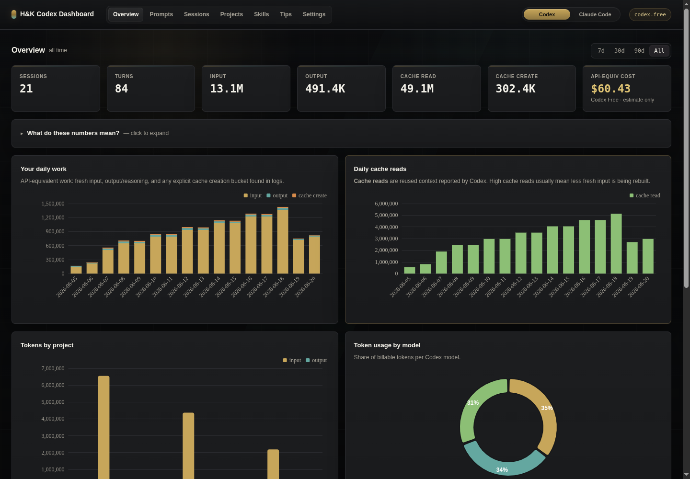
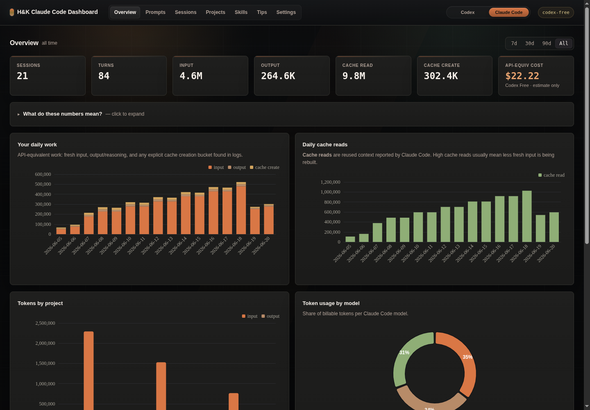

# Codex Claude Code Token Dashboard

An H&K Brothers local-first usage analytics dashboard for Codex and Claude Code. It reads Codex JSONL rollout logs under `~/.codex/sessions/` and Claude Code project logs under `~/.claude/projects/`, then turns them into prompt cost estimates, tool/file heatmaps, cache analytics, project comparisons, skill usage, session drill-downs, and rule-based efficiency tips.

Everything runs locally. No telemetry, no login, no remote calls for your session data.

Maintained as an H&K Brothers tool.

## Screenshots

### Codex overview



### Claude Code overview



## What this is useful for

- Seeing which prompts and sessions consume the most tokens.
- Comparing Codex and Claude Code usage across workspaces and projects.
- Spotting repeated shell commands, oversized tool results, and expensive turns.
- Understanding cached input versus fresh input from Codex `token_count` events.
- Estimating API-equivalent cost from editable model pricing.

## Prerequisites

- Python 3.8 or newer.
- Codex and/or Claude Code installed and used at least once so local JSONL logs exist.
- A modern web browser.

No `pip install`, no Node.js, no build step.

## Installation & Quickstart

```bash
git clone https://github.com/H-KBrothers/Codex-ClaudeCode-Token-Dashboard.git
cd Codex-ClaudeCode-Token-Dashboard
python3 cli.py dashboard
```

The command:

1. Scans `~/.codex/sessions/` and `~/.claude/projects/`.
2. Builds/updates a local SQLite cache at `~/.codex/Codex-ClaudeCode-Token-Dashboard.db`.
3. Starts a local server at `http://127.0.0.1:8080`.
4. Opens the dashboard in your browser.

Leave it running; it rescans every 30 seconds and pushes updates live. Stop with `Ctrl+C`.

## Data Sources

Codex writes JSONL rollout files here:

| OS | Path |
|---|---|
| macOS / Linux | `~/.codex/sessions/YYYY/MM/DD/rollout-*.jsonl` |
| Windows | `C:\Users\<you>\.codex\sessions\YYYY\MM\DD\rollout-*.jsonl` |

The dashboard only reads these files. It never modifies Codex transcripts.

Claude Code writes JSONL project files here:

| OS | Path |
|---|---|
| macOS / Linux | `~/.claude/projects/<project-slug>/*.jsonl` |
| Windows | `C:\Users\<you>\.claude\projects\<project-slug>\*.jsonl` |

The top-bar switch lets you inspect Codex or Claude Code with separate visual themes and source filters.

To point at another location:

```bash
python3 cli.py dashboard --projects-dir /path/to/codex/sessions --claude-projects-dir /path/to/claude/projects --db /path/to/cache.db
```

## Environment Variables

| Var | Default | Purpose |
|---|---|---|
| `PORT` | `8080` | Local web server port |
| `HOST` | `127.0.0.1` | Bind address. Keep the default unless you intentionally want LAN access. |
| `CODEX_SESSIONS_DIR` | `~/.codex/sessions` | JSONL root to scan |
| `CLAUDE_PROJECTS_DIR` | `~/.claude/projects` | Claude Code JSONL root to scan |
| `CODEX_DASHBOARD_DB` | `~/.codex/Codex-ClaudeCode-Token-Dashboard.db` | SQLite cache path |

`TOKEN_DASHBOARD_DB` and `CODEX_PROJECTS_DIR` are still accepted as compatibility aliases.

## CLI Reference

```bash
python3 cli.py scan          # populate / refresh the local DB, then exit
python3 cli.py today         # today's totals in the terminal
python3 cli.py stats         # all-time totals in the terminal
python3 cli.py tips          # active suggestions in the terminal
python3 cli.py dashboard     # scan + serve the UI

python3 cli.py dashboard --no-open
python3 cli.py dashboard --no-scan
```

Change the port:

```bash
PORT=9000 python3 cli.py dashboard
```

## Accuracy Notes

Codex `token_count` events include both cumulative totals and `last_token_usage`. This dashboard sums `last_token_usage` only; summing cumulative totals would over-count usage.

Codex reports `cached_input_tokens` inside the input total. The scanner splits that into `cache_read_tokens` and keeps only fresh input in `input_tokens`.

Claude Code transcripts use the original Claude Code message format. The scanner keeps those rows under `source='claude'` so they can be filtered separately from Codex.

Cost is API-equivalent. If you use Codex through a ChatGPT subscription, this does not mean you were separately billed that amount. Edit `pricing.json` when model prices change or when a private/internal Codex model slug needs a custom rate.

## Privacy

The browser fetches JSON from `127.0.0.1`, and all JS/CSS/chart code is served locally from this project. Use `Cmd/Ctrl+B` in the dashboard to blur prompt text before screenshots.

## Tech Stack

Python stdlib for the CLI, scanner, SQLite cache, and HTTP/SSE server. Vanilla JS + ECharts for the UI.

Data flow:

`cli.py` -> `token_dashboard/scanner.py` -> SQLite -> `token_dashboard/server.py` -> `web/`

## Development

```bash
python3 -m unittest discover tests
```

See `CODEX.md` for the architecture map and local conventions.

## License

MIT. See `LICENSE`.
